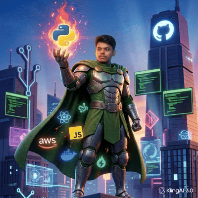

<!-- ═══════════════════════════════════════════════ -->
<!--               HERO — GIF + NAME                -->
<!-- ═══════════════════════════════════════════════ -->

<table border="0" cellpadding="0" cellspacing="0">
  <tr>
    <td align="right" valign="middle" width="42%">
      
    </td>
    <td width="8%"></td>
    <td align="left" valign="middle" width="50%">
      <h1>
        
      </h1>
      

        
      

       
      
      
       
      
      
       
      
        
      
      &nbsp;
      
    </td>
  </tr>
</table>

---

<!-- ═══════════════════════════════════════════════ -->
<!--                   ABOUT ME                     -->
<!-- ═══════════════════════════════════════════════ -->

## 👤 About Me

- 🎓 **Education:** Pursuing B.Tech in Computer Science, focused on AI/ML & Full-Stack Development
- 💻 **Role:** FullStack AI Developer — building intelligent web applications end-to-end
- 🤖 **Passion:** Merging AI/ML with modern web technologies to solve real-world problems
- 🌾 **Currently Building:** AgriTech AI, FranchiseOps-AI, and NLP-powered tools
- 📚 **Currently Learning:** Advanced ML pipelines, LLMs, and scalable cloud deployments
- 🧠 **Tech Interests:** Prompt Engineering, NLP, REST APIs, Full-Stack Architecture, Streamlit Apps
- 📧 **Reach Me:** kpalanigithub@gmail.com

---

<!-- ═══════════════════════════════════════════════ -->
<!--              HIGHLIGHTED PROJECTS              -->
<!-- ═══════════════════════════════════════════════ -->

## 📁 Highlighted Projects

[**Agritech AI**](https://github.com/k-palani-2K04): An AI-powered agricultural intelligence platform that helps farmers make smarter decisions using **Machine Learning** and **Computer Vision** — built with **Python**, **Flask**, and **React**.

[**FranchiseOps-AI**](https://github.com/k-palani-2K04): Smart franchise operations management system powered by AI, providing real-time analytics and automated insights — built with **Node.js**, **Express.js**, **MongoDB**, and **React**.

[**Text Summarizer**](https://github.com/k-palani-2K04): NLP-driven document summarization tool using **Hugging Face** transformer models for fast, context-aware text condensation — deployed with **Streamlit**.

---

<!-- ═══════════════════════════════════════════════ -->
<!--                  TECH STACK                    -->
<!-- ═══════════════════════════════════════════════ -->

## 🛠 Tech Stack

<!-- Row 1 -->

 

<!-- Row 2 -->

 

<!-- Row 3 -->

 

<!-- Row 4 -->

---

<!-- ═══════════════════════════════════════════════ -->
<!--                  FOOTER WAVE                   -->
<!-- ═══════════════════════════════════════════════ -->

  ⭐ Star a repo if you find my work useful — it keeps me motivated to keep building! ⭐

